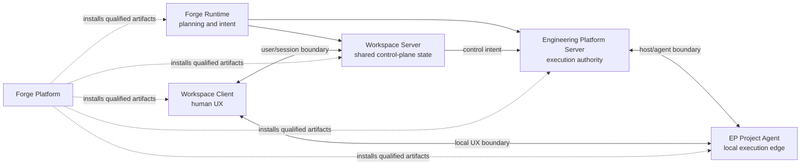
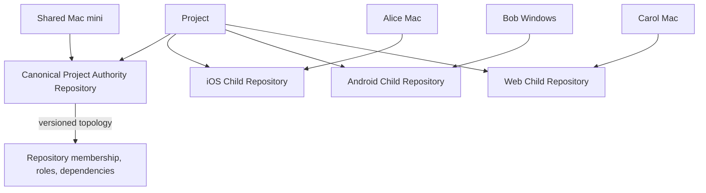
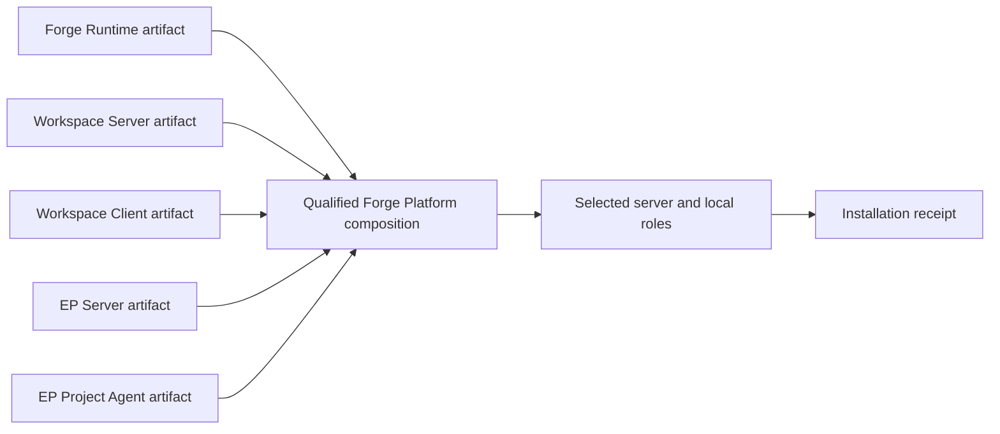

# Forge Platform Architecture

## Purpose and status

This is the canonical high-level architecture entrypoint for the Forge Platform ecosystem composition. It records product and trust boundaries needed for later work; it does not implement an installer, service, protocol, scheduler, authentication flow, artifact publication, or Schema 41.

Forge Platform is a first-class product repository, not a canonical project authority repository for a customer's product. A **Canonical Project Authority Repository** is a logical product's durable topology authority; `pcvantol/forge-platform` is the Forge-family distribution and deployment product.

Detailed decisions are recorded in the [ADRs](adr/README.md). The [ownership matrix](OWNERSHIP_MATRIX.md) is the concise authority reference.

## First-class component model

| Repository | First-class authority / published component |
| --- | --- |
| `pcvantol/forge` | Forge Runtime: architecture planning and orchestration |
| `pcvantol/workspace` | Workspace Server and Workspace Client(s) |
| `pcvantol/engineering-platform` | Engineering Platform Server and Engineering Platform Project Agent |
| `pcvantol/technical-debt-engine` | Technical Debt Engine product authority |
| `pcvantol/forge-platform` | Universal distribution, deployment, and release composition |
| `pcvantol/ai-development-contracts` | Generic AI-development contract authority |
| `pcvantol/ai-platform-engineering-knowledge-base` | Generalized and certified engineering knowledge authority |

Forge, Workspace, and Engineering Platform are peers. No product repository is a parent source authority for another.

## Product boundaries

### Forge Runtime

Forge owns product/system architecture planning, roadmap and backlog reasoning where Forge-owned, engineering intent, development-lane planning, cross-repository dependency planning, and the conceptual determination of work that may run in parallel. It does not own local repository execution, EP scheduling implementation, EP evidence/qualification, Workspace shared UI state, Project Agent behavior, or universal installation.

### Workspace Server and Workspace Client

Workspace Server is the shared control-plane and product-team state service. It owns Workspace project state, topology presentation, shared team/user status, Workspace-owned lane and scheduling UX state, sessions, and aggregation of Forge and EP information. It is not execution authority.

Workspace Client is human-facing UX. It authenticates to a Workspace Server and presents the same server-authoritative shared project state as other clients, subject to permissions. It can initiate canonical control-plane actions, but does not become shared-state authority or directly execute engineering work through an Agent.

Local facts such as repository presence, current branch, IDE availability, and installed tools may augment shared state. They never redefine authoritative product/project truth. A Workspace Client without a Project Agent is a valid first-class deployment: it supports shared views, planning/status, reports, and permitted remote actions through eligible Agents, but not local repository, host, or IDE operations.

### Engineering Platform Server and Project Agent

Engineering Platform Server is execution authority. It owns engineering admission, durable queueing/scheduling, lane admission, host/agent selection, repository execution locking, provider execution, validation, qualification, evidence, EP-owned Prompt History, finalization/execution state, Consumer API, and server-side Agent protocol authority. Forge and Workspace do not bypass it.

Engineering Platform Project Agent belongs solely to `pcvantol/engineering-platform`. One installed Agent service/process per host and OS-user context may serve zero or more locally attached repositories. It owns the local repository/Git/filesystem boundary, attachment/discovery, host-capability discovery, bounded local execution, secure local credential handling, health, approved local IPC, and protocol communication with EP Server. It is not owned by Forge, Workspace, or Forge Platform.

An Agent is not one binary or process per repository. A repository may later contain non-secret declarative configuration such as `.engineering/project.json`; secrets remain in OS-native secure credential storage.

## Project, repository, host, Agent, and lane model

| Domain identity | Canonical relationship |
| --- | --- |
| Project | Has exactly one Canonical Project Authority Repository and zero or more Child Repositories. |
| Repository | Belongs to one logical Project context when attached and may be available on one or more Hosts. |
| Host | A machine or environment. |
| Engineering Platform Project Agent | Local repository and execution capability on one Host; exposes zero or more repositories. |
| Execution Lane | Belongs to one Project, targets one or more repositories, has dependencies, and requires repository execution resources/locks. |

A single-repository Project is the trivial case: its Canonical Project Authority Repository is also its only source/execution repository. No separate architecture is required.

A multi-repository Project has one Canonical Project Authority Repository plus zero or more autonomous Child Repositories. Child membership is a project-topology relationship, not Git submodule or source-control subordination.

The Canonical Project Authority Repository owns durable, versioned cross-repository concerns: product-wide architecture and ADRs, Forge and Workspace project definitions, membership/topology, EP project topology/configuration, appropriate product-wide AI-development projection/extension, TDE integration/profile, and cross-repository planning boundaries. It need not contain application source.

Logical topology is **Project → repositories, roles, dependencies**. Physical topology is **Repository → available Hosts and Agents**. Versioned project authority documentation/configuration must reconstruct logical topology; Workspace Server persistence is not its sole source of truth. EP uses both topologies for execution eligibility.

## Team, offline, and capability model

Team deployment is first-class: different developers can hold different repositories on different hosts, each with its own Agent. Workspace shared state spans those hosts. EP can observe Agent health, repository availability, host capabilities, and lane status without assuming every host has every checkout.

Agents may be offline. Forge planning and Workspace shared state remain available; EP may wait for an eligible host/Agent rather than infer availability. This document uses no final state-machine constant.

Agents discover host capabilities such as Xcode/iOS signing, .NET/Windows, Android SDK, Docker, Python, Node, OS, and architecture. Forge may express planning requirements; EP alone determines actual eligibility and admission.

## Execution lanes, dependencies, and locks

Forge plans lane dependencies. EP admits executable work and enforces ordering.

The safe initial concurrency rule is **at most one mutating Execution Lane per Repository at a time**. Repository-level locks are the initial resource model:

- a lane touching `ios` locks `ios`;
- a lane touching the Canonical Project Authority Repository and `ios` locks both;
- an Android-only lane may proceed concurrently if it has no plan dependency.

Resource exclusion and plan dependency are distinct. The same repository excludes simultaneous mutation even without a planned dependency. Different repositories may still need A → B sequencing because Forge planned it. Future same-repository parallelism using separate worktrees, disjoint declared scopes, and no shared generated/migration resources is explicitly deferred.

## Deployment, artifacts, and installer roles

Forge Platform owns universal installation, deployment profiles, component selection, manifests, validated compatibility matrix, artifact acquisition/verification, topology bootstrap, upgrades, repair, uninstall, installer/updater UX, and installation receipts.

It consumes independently published artifacts and does not compile or repackage product source as a hidden monolith:

| Product repository | Artifact ownership |
| --- | --- |
| Forge | Forge Runtime artifact |
| Workspace | Workspace Server and Workspace Client artifacts |
| Engineering Platform | Engineering Platform Server and Engineering Platform Project Agent artifacts |
| Forge Platform | Validated composition and distribution of those artifacts |

A Forge Platform release is a tested composition, not a monorepo source version. Each product owns its version and protocol implementation; Forge Platform owns the cross-product compatibility declaration used for a platform release/install.

Installable roles remain independent:

| Role class | Components |
| --- | --- |
| Server | Forge Runtime; Workspace Server; Engineering Platform Server |
| Local | Engineering Platform Project Agent; Workspace Client |

Conceptual presets are Complete Forge Platform, Server, Developer Workstation, and Custom. A Project Agent may be installed without a Workspace Client (for example, a dedicated Linux, Windows, or Xcode host), and a Workspace Client may be installed without an Agent. A typical developer workstation has both, with independent trust relationships.

## Trust and runtime boundaries

There are three distinct relationships:

1. **Workspace Client ↔ Workspace Server:** user/client/session trust. LAN presence is not authorization.
2. **Project Agent ↔ EP Server:** host/agent execution trust. Agent identity and credentials are independent of Workspace user authentication.
3. **Workspace Client ↔ local Project Agent:** machine-local repository/host UX integration. It may expose health/version, local project attachment, repository metadata/status, host/tool capability, IDE opening, and other approved local UX operations. It cannot bypass EP admission, provider execution, durable scheduling, finalization/merge authority, direct task execution, or TDE.

The future **EP Local Project Agent API Contract** is owned by Engineering Platform; Workspace owns its consumer/adapter implementation. Forge Platform owns neither side of that protocol.

Co-location changes no authority. An EP Server and Project Agent on the same machine still use the canonical Agent↔Server contract; EP Server does not directly access local repositories. Localhost never implies trust or authentication bypass.

The family runtime rule is: **source checkouts develop, test, and build; published/installed artifacts run.** In particular, an Engineering Platform source checkout never becomes runtime authority.

## Explicitly open implementation questions

The following are intentionally not canonicalized here:

- Workspace↔local-Agent transport and IPC mechanism;
- Project topology manifest schema;
- network discovery protocol;
- concrete authentication and pairing mechanisms;
- detailed Agent protocol and Local Agent API;
- Workspace Server persistence implementation;
- durable scheduling API;
- same-repository parallel execution contract.

## Terminology

Use these terms consistently: **Forge Runtime**, **Workspace Server**, **Workspace Client**, **Engineering Platform Server**, **Engineering Platform Project Agent**, **Forge Platform**, **Project**, **Canonical Project Authority Repository**, **Child Repository**, **Host**, and **Execution Lane**. “Adapter” is only a consumer/UX term where needed; the runtime component is the Engineering Platform Project Agent.
