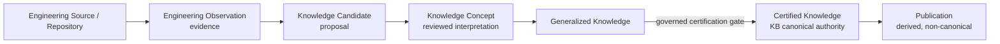
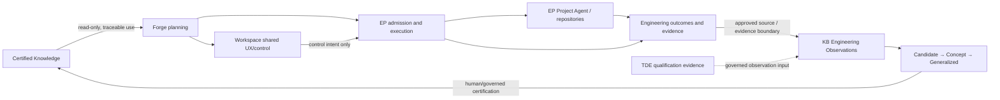

# Governed Engineering Knowledge Learning Loop

## Decision summary

`pcvantol/ai-platform-engineering-knowledge-base` (the Knowledge Base or **KB**) is the canonical repository for reusable AI Platform Engineering knowledge lifecycle, certification, and publication. It is not a generic product runtime, a Workspace Server, an Engineering Platform component, or a Forge Platform installable server role.

**Deployment decision: KB CURRENTLY CLI/REPOSITORY CAPABILITY.** Its canonical state is Git-backed structured content, operated by the repository-local `bin/aikb` Python CLI. No package metadata, published versioned runtime artifact, release, tag, server/API, daemon, database, or product installation contract was found. Forge Platform must therefore not add it to current installer role selection. Any future KB artifact is a productization prerequisite, not an inferred deployment decision.

This document records repository truth from KB `main` at `0c0df2127ce68cc54a2e78bc440781531e5c1399`. It is an integration architecture analysis, not an implementation plan or ownership transfer.

## Current KB capability and storage truth

The KB stores lifecycle objects, source profiles, lineage, certification cycles, publications, reports, templates, and governance as versioned files in its Git repository. `aikb` is a thin Python CLI (`bin/aikb` plus `cli/aikb_cli/`), with one unit-test module and GitHub Actions validation/CodeQL. It is neither a long-running service nor a network API.

| Capability | Maturity and executable evidence | Boundary / limitation |
| --- | --- | --- |
| Knowledge Source registration/onboarding | **IMPLEMENTED**: `aikb onboard` writes a source and extraction profile inside the KB. | Source approval remains governed; it does not modify the source repository. |
| Repository observation/extraction | **IMPLEMENTED**: `aikb extract` selects registered profiles, shallow-clones each source into a temporary directory, records source HEAD, discovers selected Markdown evidence, and writes Engineering Observations plus indexes in the KB. | Current extractor is Markdown filename/content convention based; it does not ingest arbitrary code, PRs, telemetry, incidents, or EP evidence exports. |
| Candidate generation | **IMPLEMENTED**: `aikb classify` creates Knowledge Candidates from observations. | Candidate remains non-canonical. |
| Concept formation | **IMPLEMENTED**: `aikb review` forms project-aware Knowledge Concepts. | It is not cross-project certification. |
| Generalization | **IMPLEMENTED**: `aikb generalize` creates Generalized Knowledge with preserved lineage. | Reusability/governance remains a review concern. |
| Certification | **PARTIALLY_IMPLEMENTED**: `aikb certify` checks lineage/readiness and writes Certified Knowledge and a certification-cycle record. | KB governance requires governed/human certification and forbids AI self-certification; the CLI has no separate human-approval input or external policy gate. CLI output is not a substitute for that authority. |
| Publication | **ARCHITECTURE_ONLY**: lifecycle records and documentation exist. | `aikb publish` is not parser-registered or executable. |
| Query/retrieval | **IMPLEMENTED**: `aikb ask` deterministically searches Certified Knowledge metadata/text and renders lineage. | No API, embedding, vector index, remote search, or external documentation retrieval. |
| Generators/templates | **IMPLEMENTED**: `aikb init` and `aikb generate` write explicit output directories from Certified Knowledge. | Generated output is derived, not canonical knowledge. |
| Evolution, quality, validation, statistics | **IMPLEMENTED**: `aikb evolve`, `validate`, `improve`, `status`, and `stats`. | Reports/findings do not modify knowledge or approve remediation. |
| Automation / continuous evolution | **DOCUMENTED ARCHITECTURE** with CI validation only. | No source polling, event trigger, scheduler, continuous extractor, health dashboard, or automatic drift workflow. |
| Multi-agent runtime, goals, missions, capabilities, qualification | **ARCHITECTURE_ONLY / PLACEHOLDER**. | CLI namespaces are documented but not parser-registered or executable. |

The KB CLI reports 14 implemented commands: `init`, `onboard`, `extract`, `classify`, `review`, `generalize`, `certify`, `ask`, `generate`, `evolve`, `validate`, `improve`, `status`, and `stats`. It reports 37 architecture-only placeholders, including `agent`, `run`, `plan`, `capability`, `goal`, `mission`, `qualify`, `publish`, and `doctor` namespaces/commands.

## Terminology and lifecycle authority

The KB uses **ingestion** as the broad governed pipeline from an approved Knowledge Source through source scan, observation detection/normalization, candidate proposal, candidate registration, and human review. **Extraction** is the evidence-observation activity within that pipeline. Current `aikb extract` implements only the first operational extraction step: it creates Engineering Observations; `aikb classify` creates Candidates. Forge Platform preserves these terms rather than collapsing them.

Engineering Sources and Observations are evidence. Candidates and Concepts are non-canonical proposals/interpretations. Generalized Knowledge is eligible for governed certification but is not authoritative Certified Knowledge. Certified Knowledge is the highest internal KB authority. Publications are derived and never canonical.

The read-only source principle is strict: KB operations may write lifecycle records, reports, and explicit output paths in the KB or selected output location, but never source files, branches, commits, releases, configuration, or history. There is no implemented KB command authorized to mutate a registered Knowledge Source.

## Current source and consumption coverage

The current registered KB sources are DJConnect-related only: `KS-DJCONNECT-001`, `KS-GITHUB-DJCONNECT-001`, and `KS-PCVANTOL-DJCONNECT-WINDOWS-001`. The generic onboarding/extraction model can register a Git repository URL and inspect supported Markdown evidence today, so Forge, Workspace, Engineering Platform, Forge Platform, and TDE could be onboarded only through separate source approval and source-specific extraction-profile work. None is currently registered.

Current supported-by-model evidence includes repositories, architecture and decision documents, verification/coverage/qualification reports, release/changelog material, source code, issue/commit history, incidents, operational evidence, and postmortems. The implemented extractor currently realizes a narrower subset: selected Markdown documents in a shallow clone. EP receipts, provider activity, Prompt History, host facts, TDE evidence exports, PRs, and raw telemetry require explicit evidence/export/profile work before they can enter a KB lifecycle.

Certified Knowledge is consumable today through the local `aikb ask`, `init`, `generate`, `evolve`, `validate`, and `improve` flows. Forge has a separate implemented metadata-only read-only Knowledge Source registry/consumer; it does not currently call `aikb`, retrieve KB contents, or provide a KB integration adapter. Workspace and EP have no current KB integration. No API/service contract exists or is required for the first integration increment.

## Governed platform learning loop

Knowledge integration is additive: Forge can plan, EP can execute, and Workspace can present projects without KB availability. KB use must never become an implicit admission or execution dependency.

| Stage | Authority | Input → output | Automation level | Governance gate | Current support / future integration |
| --- | --- | --- | --- | --- | --- |
| Source registration | KB | repository context → approved source profile | CLI-assisted | source approval | Implemented for generic Git source registration; product sources not registered. |
| Observation capture | KB | allowed source evidence → Engineering Observation | manual CLI today; future automatable | extraction policy | Implemented Markdown clone/extraction only. |
| Candidate generation | KB | Observation → Candidate | CLI-assisted / future automatable proposals | candidate review | Implemented. |
| Concept/generalization | KB | Candidates → Concept → Generalized Knowledge | CLI-assisted | review/promotion | Implemented; no automatic authority. |
| Certification | KB governance | Generalized Knowledge → Certified Knowledge | readiness checks may assist | independent human/governed certification | CLI writes records; governance control remains external to code. |
| Knowledge consumption | KB | Certified Knowledge → traceable answer/derived output | read-only deterministic | none changes authority | Implemented locally; cross-product contracts missing. |
| Planning use | Forge | Certified Knowledge reference → planning rationale | future consumer integration | Forge governance | Missing KB adapter/contract. |
| Execution | EP | Engineering Action → evidence/receipt | implemented independently | EP admission | No KB dependency; future evidence export is missing. |
| Evidence feedback | KB | approved evidence → observation | future profile/export automation | source/evidence approval | Repository extraction exists; EP/TDE exports missing. |

Automation may safely assist source polling, observation capture, duplicate/relationship suggestions, candidate proposals, cross-source clustering, validation, and drift signals. It must not approve sources, accept/promote candidates, certify knowledge, create normative contracts, approve publications, or treat its own generated evidence as authority.

The self-certification invariant is: **no system becomes authoritative merely because it produced evidence about itself.** EP success, a Project Agent result, TDE qualification, Forge planning output, and KB automation output are observations/evidence only. They never become Certified Knowledge without the independent KB lifecycle and governed certification gate.

## Integration gaps and ownership

| Integration | Current support | Missing contract / prerequisite | Future owner | Priority |
| --- | --- | --- | --- | --- |
| Repository → KB | **PARTIAL** | source approval plus source-specific extraction profile; current extractor is Markdown-only | KB | K1/K2, non-blocking |
| Forge → KB | **MISSING** | governed export/observation profile for durable decisions, intent outcomes, and lane dependencies | KB + Forge | K3, non-blocking |
| EP → KB | **MISSING** | explicit evidence export contract and inclusion/exclusion/privacy policy | KB + EP | K3, non-blocking |
| Workspace → KB | **NOT_REQUIRED** for direct writes | UX may initiate governed KB actions only | Workspace + KB | K5, non-blocking |
| KB → Forge | **PARTIAL** | read-only Certified Knowledge consumption contract/adapter; no direct internal-file coupling | Forge + KB | K4 |
| KB → EP | **ARCHITECTURE_ONLY** | read-only knowledge constraint/recommendation contract | EP + KB | later, non-blocking |
| KB → Workspace | **MISSING** | read-only UX/query/status contract | Workspace + KB | K5, non-blocking |
| Project Agent → KB | **NOT_REQUIRED** for repository extraction | Agent is not a prerequisite: KB can observe registered Git sources independently | KB | none |
| TDE → KB | **PARTIAL** by model only | explicit public TDE evidence selection/export profile | KB + TDE | K3, non-blocking |
| KB → TDE | **NOT_REQUIRED** initially | no change to TDE semantics or qualification authority | TDE | none |
| Forge Platform → KB distribution | **MISSING** | versioned published KB artifact, install contract, persistent-storage/backup model | KB, then Forge Platform | K7 |

EP remains evidence producer, never KB certification authority. TDE remains qualification authority; its evidence may become an Engineering Observation, but KB does not replace TDE semantics. AI Development Contracts remains separate normative generic-contract authority. KB may observe it only through an explicit approved source policy and must never promote its own knowledge into competing normative contract authority.

## Freshness, negative learning, and cross-project reuse

The KB continuous-evolution model already provides governed drift, impact review, revision, re-certification, supersession, retirement, restoration, and history preservation. New contradictory evidence is a drift signal, not an automatic invalidation. This is the canonical mechanism for freshness and supersession; Forge Platform creates no second model.

Failures, rollbacks, blocked work, security findings, invalid assumptions, and qualification failures are legitimate evidence types when an approved extraction policy preserves relevant provenance and excludes secrets/personal data. They can create observations and candidates, not automatic negative Certified Knowledge.

Cross-project learning preserves individual source identity and lineage. Independent observations across DJConnect, Forge, Workspace, EP, and future products can strengthen a reusable concept; source diversity strengthens evidence but does not turn any product repository into canonical knowledge. Product-specific/private details remain bounded by each source's approved extraction profile.

## Deployment and productization prerequisites

Current KB deployment is a persistent Git clone/worktree plus repository-local CLI. This implies versioned Git history, explicit remote synchronization, backup, and concurrency/governance policies before shared-team operation; no database migration architecture is inferred.

Before Forge Platform can install KB as an optional runtime capability, KB must define at least:

- a versioned published artifact and supported installation method;
- a supported persistence, backup, update, and concurrent-access model;
- artifact integrity/provenance and compatibility metadata;
- a clear local/shared/multi-user operating mode; and
- any required API/service boundary, only if CLI/Git consumption is insufficient.

No network API is currently required for the first integration: explicit CLI/Git-backed, read-only consumption and approved observation workflows can establish initial value. A service must not be introduced merely for product symmetry.

## Bounded roadmap

| Stage | Scope |
| --- | --- |
| K0 | Current-state truth and learning-loop architecture canonicalization |
| K1 | Governed registration of first-class product repositories as Knowledge Sources |
| K2 | Source-specific extraction profiles and validation boundaries |
| K3 | Explicit EP and public TDE evidence-to-observation contracts |
| K4 | Forge read-only Certified Knowledge consumption contract |
| K5 | Workspace learning-loop visibility and governed control UX |
| K6 | Governed automated observation extraction, health, and drift signals |
| K7 | KB productization and optional Forge Platform distribution/composition, if qualified |

## Explicitly unresolved

- KB service/API need and transport;
- EP evidence export contract and privacy/redaction policy;
- Forge Certified Knowledge consumption contract;
- Workspace learning-loop UX/query contract;
- event/schedule triggers and automation cadence;
- multi-user/concurrent KB access model;
- artifact publication and versioning;
- persistent deployment, backup, and remote synchronization model;
- source authentication and access policy.
