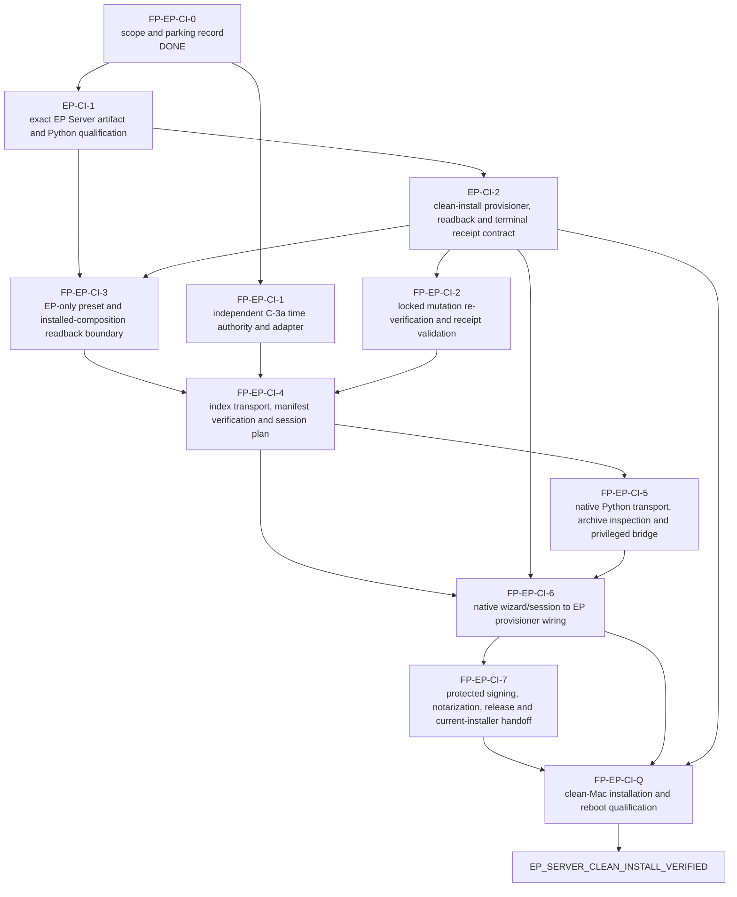

# EP Server clean-install v1 parking roadmap

**Status:** canonical scoped planning record; implementation and operational
qualification are **PARKED**.

**Recorded:** 10 September 2026, against Forge Platform `main`
`39580a85ed322fd7feeb37734f19445e36d4902c`.

This document records the agreed resumption point for the Universal Installer.
It narrows the first operational target to one independently qualified
Engineering Platform (EP) Server clean installation. It does not authorize a
release, a machine mutation, a service registration, a credential, a product
data migration, or a cleanup operation. The system architecture, ownership
matrix, and Universal Installer contract remain authoritative for boundaries.

The graph below is a Forge Platform **documentary planning DAG**. It is not a
Forge engineering execution DAG, does not allocate an Action, and does not
change Engineering Platform's admission or installation authority.

## v1 outcome and strict boundary

The sole v1 outcome is `EP_SERVER_CLEAN_INSTALL_VERIFIED`:

- a released, signed and notarized, thin `arm64` Forge Platform Installer runs
  natively on an Apple Silicon Mac running macOS 26 or newer;
- it selects one immutable, signed `ep-server-clean` composition containing
  only the EP Server artifact and its exact approved managed-Python runtime;
- that composition declares no user-scoped provider requirement. It installs
  neither GitHub CLI, Codex CLI, Forge, Workspace, nor an EP Project Agent, and
  requests no provider login;
- the exact Python runtime artifact, provenance, ABI/tags, build/test proof and
  per-product venv identity are verified without consulting `PATH`, system
  Python, Homebrew Python, or a network "latest" lookup;
- the installer passes its current-installer, catalog, host and artifact gates
  before handing the exact EP Server request to an EP-owned provisioner;
- the EP-owned provisioner performs the clean product installation, any
  necessary root-authorized system-domain service registration, resolver and
  health/instance readback, and terminal product receipt; and
- a clean-Mac qualification proves a fresh shell and a reboot resolve the same
  installed EP Server and its identity-aware health evidence.

Administrator authorization may be necessary for the EP-owned system service.
That is distinct from a GitHub, Codex, or other provider login. This v1 target
does not promise offline installation; any online catalog or artifact path must
retain the contract's signed, pinned and independently time-attested admission
rules.

An existing, unhealthy, conflicting, or merely different EP installation is
outside this clean-install path and must block before product mutation. It does
not silently become an upgrade, repair, migration, rollback, removal, or
uninstall operation.

## Explicitly deferred from v1

The following remain planned, but are not acceptance requirements for
`EP_SERVER_CLEAN_INSTALL_VERIFIED`:

- Forge Runtime, Workspace Server, Workspace Client, and EP Project Agent
  installation;
- managed Git, GitHub CLI, Codex CLI, provider authentication, or any
  user-scoped provider credential;
- EP upgrade, repair, data/service migration, rollback, uninstall, or cleanup;
- cross-component discovery, pairing, remote-peer topology and summary UX; and
- all-server, developer-workstation, custom, Forge+EP, and Workspace+EP
  compositions.

Deferral changes no product ownership. In particular, Engineering Platform
continues to own its service, data, runtime selection, migration, rollback,
cleanup, resolver and health semantics. Forge Platform only coordinates an
exact qualified request and consumes correlated readback and receipts.

## Verified source baseline at parking

| Capability | Current evidence | Operational status |
| --- | --- | --- |
| Native host boundary | Apple Silicon-only, macOS-26-or-newer preflight; Intel, Rosetta, `x86_64`, and fat binaries fail closed before platform mutation | `SOURCE_FIXED` |
| Exact managed Python identity | Signed-catalog runtime identity, component build/test binding, immutable runtime/venv identities and no-`PATH` planning | `SOURCE_FIXED` |
| Durable Python executor kernel | Pinned acquisition/inspection inputs, immutable slots, isolated venvs, resume and frozen-identity rollback through injected adapters | `SOURCE_FIXED`; no native production adapters or runtime artifact |
| Catalog admission and component selection | Read-only signed-catalog admission and exact component-combination selection kernels | `SOURCE_FIXED`; no approved time adapter, index transport, manifest verification, or session producer |
| Native installer release foundation | SwiftUI shell, release-operation framework, unsigned candidate packager and structural verifier | `SOURCE_FIXED`; no protected signer, notarization, publication, trust resources, or live handoff |
| EP product provisioning | No EP Server clean-install provisioner adapter, installed-composition readback, terminal receipt validator, or installed-host evidence is supplied here | `NOT_IMPLEMENTED` |

Consequently this repository is `SOURCE_FIXED` only. It is not
`INSTALLATION_VERIFIED`, `SINGLE_OPERATIONAL_INSTALLATION_VERIFIED`,
`EP_SERVER_CLEAN_INSTALL_VERIFIED`, or release/publication authority.

## Documentary dependency DAG

| Node | Owner | Result required for this v1 | State at parking |
| --- | --- | --- | --- |
| `FP-EP-CI-0` | Forge Platform | This bounded outcome, non-goals, evidence labels and documentary DAG | Done by this record |
| `FP-EP-CI-1` | Forge Platform, with an approved external authority | Independently reviewed cryptographically signed time evidence, trust root/rotation, nonce and exact-byte binding for C-3a | Blocked pending authority selection; local clock, normal NTP and HTTP `Date` are not substitutes |
| `EP-CI-1` | Engineering Platform | Published EP Server artifact and exact Python build/test/provenance proof accepted by the composition | Planned |
| `EP-CI-2` | Engineering Platform | Clean-only EP provisioner request, conflict/absence readback, root-authorized service contract, health/identity readback and terminal receipt | Planned |
| `FP-EP-CI-2` | Forge Platform + EP contract consumer | Product-owned terminal-receipt validation and a separately locked re-verification boundary before mutation | Planned |
| `FP-EP-CI-3` | Forge Platform + EP contract consumer | Explicit one-component `ep-server-clean` preset/component set and product-owned installed-composition readback boundary | Planned |
| `FP-EP-CI-4` | Forge Platform | Exact index transport, immutable composition-manifest verification and durable session-plan producer | Planned |
| `FP-EP-CI-5` | Forge Platform | Native exact-runtime transport, archive/Mach-O inspection and privileged bridge using the existing fail-closed executor contract | Planned |
| `FP-EP-CI-6` | Forge Platform + EP adapter | Native wizard/session wiring that can dispatch only the exact clean-install request and preserve correlated receipts | Planned |
| `FP-EP-CI-7` | Forge Platform, protected release authorities | Protected signing, notarization, GitHub Release, sealed production resources and current-installer handoff | Blocked pending protected signing/notarization/publishing authority |
| `FP-EP-CI-Q` | Forge Platform + Engineering Platform | Authorized clean-Mac test: fresh install, service/readiness, fresh-shell and reboot resolver evidence | Planned; requires an explicitly authorized test host |

`FP-EP-CI-1`, `EP-CI-1`, and the contract portion of `EP-CI-2` may be planned
independently. No product mutation or clean-Mac test becomes eligible until all
incoming evidence edges to the applicable node are satisfied.

## Resumption rules

Resume this work from the next unimplemented DAG node whose external decision
and owner inputs are available. Do not skip directly to a live install because
the source kernels exist. In particular:

1. select and approve the independent C-3a time authority before claiming
   online catalog admission;
2. obtain the EP-owned artifact/provisioner contracts and exact runtime
   qualification before composing an EP clean-install manifest;
3. obtain protected Apple signing/notarization and GitHub publication authority
   before claiming a releasable installer; and
4. obtain explicit authorization and a scoped clean test Mac before performing
   any installation or service mutation.

Each resumed implementation increment must use an isolated worktree from the
then-current owning `main`, preserve unrelated local changes, validate the
owning repository, and deliver its evidence through its own reviewable change.
This parking record creates no credentials, keys, services, product data,
installation, cleanup, release, or external authorization.

## Broader installer horizon after v1

After `EP_SERVER_CLEAN_INSTALL_VERIFIED`, the broader Universal Installer
contract resumes with separately qualified EP lifecycle operations, then
Forge/Workspace artifact qualification and provisioners, provider/managed-tool
flows where an admitted composition requires them, cross-component discovery
and pairing, and full add/update/remove, migration/rollback, crash/reboot and
readiness qualification. None is implied by the v1 result.
